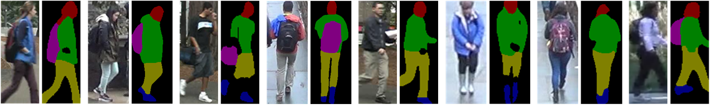
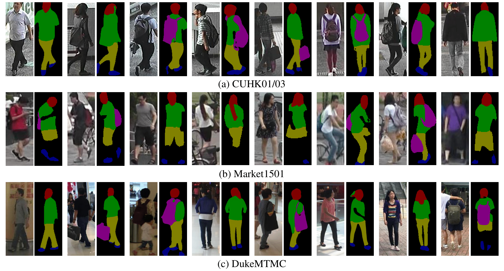

# Human Parsing Network

## Introduction
This is the repo of human parsing network used in [ViTAA: Visual-Textual Attributes Alignmentin Person Search by Natural Language](https://arxiv.org/abs/2005.07327).
It is trained to generate high-quality attribute categories: **head** (including descriptions related to hat, glasses, and face), 
clothes on the **upper body**, clothes on the **lower body**, **shoes** and **bags** (including backpack and handbag).
The network is built on [HRNet](https://arxiv.org/abs/1904.04514), for more information please check [here](https://github.com/HRNet/HRNet-Semantic-Segmentation).



## Citation
If you find this work or code is helpful in your research, please cite **ViTAA** and **HRNet**:
````
@misc{wang2020vitaa,
    title={ViTAA: Visual-Textual Attributes Alignment in Person Search by Natural Language},
    author={Zhe Wang and Zhiyuan Fang and Jun Wang and Yezhou Yang},
    year={2020},
    eprint={2005.07327},
    archivePrefix={arXiv},
    primaryClass={cs.CV}
}

@inproceedings{SunXLW19,
  title={Deep High-Resolution Representation Learning for Human Pose Estimation},
  author={Ke Sun and Bin Xiao and Dong Liu and Jingdong Wang},
  booktitle={CVPR},
  year={2019}
}
````

## Quick start
As mentioned in ViTAA, the network is first trained on human parsing dataset MHPv2, 
and then trained on clothes parsing dataset ATR. Lastly, it is finetuned on the VIPeR dataset.
Due to the low resolution of pedestrian images captured in surveillance scenes, 
we slightly modify the network by changing the strides in the third transition layer to double 
the feature scale of the last resolution path.

### Freebie
If you want to generate segmentation maps on other datasets like CUHK01/03, Market1501, or DukeMTMC, 
please put them in the ./data folder. Then download the weight file ([GoogleDrive](https://drive.google.com/file/d/1CYhS5AXMnMtcv9MVq5luHLrZciAwhfqn/view?usp=sharing)
/ [BaiduYun(code: rij6)](https://pan.baidu.com/s/1lpHJmHcDXd2TsC3rn0TaFg)) and put it in the ./pretrained_models folder.
Finally, run the config files in the ./experiments folder and the results are saved in the ./output folder. 

For example:
 ````bash
python tools/test.py --cfg experiments/market1501/seg_hrnet_w48_market1501.yaml
````



### Data preparation
You need to download the [MHPv2](https://lv-mhp.github.io/), [ATR](https://github.com/lemondan/HumanParsing-Dataset) and [VIPeR](http://www.cbsr.ia.ac.cn/users/jwan/papers/TIP2019-PedAttri.pdf) datasets.

Your directory tree should be look like this:
````bash
$ROOT/data
├── atr
│   ├── JPEGImages
│   ├── SegmentationClassAug
│   └── atr_label.txt
├── LV-MHP-v2
│   ├── train
│   │   ├── images
│   │   ├── parsing_annos
│   │   └── pose_annos
│   ├── val
│   │   ├── images
│   │   ├── parsing_annos
│   │   └── pose_annos
│   ├── test
│   │   └── images
│   └── list
├── viper
│   └── Parsing-final
├── list
│   ├── atr
│   │   ├── trainList.lst
│   │   └── valList.lst
│   ├── mhp
│   │   ├── trainList.lst
│   │   └── valList.lst
│   ├── viper
│   │   ├── trainList.lst
│   │   └── valList.lst
````

Next, you need to transform the data to the modeified format. The codes (atr2lip.py, mhp2lip.py, viper2lip.py) are provided in the ./tools folder. In these codes, we first crop
the images based on the annotations to extract single person or remove backgrounds, and then summarize the abundant categories into 9 categories:
 ````bash
0 -> background
1 -> head(hair)
2 -> upper
3 -> lower
4 -> shoes
5 -> bag
6 -> head(hat)
7 -> head(face)
8 -> arm
9 -> leg
````

### Training
For all the experiments, we use HRNet-W48 as the backbone, please download the [pretrained model](https://github.com/HRNet/HRNet-Image-Classification) and put it in the 
./pretrained_models folder. You can find all the config files in the ./experiments folder.

For example, train the HRNet-W48 on MHPv2 with a batch size of 32 on 4 GPUs:
````bash
python -m torch.distributed.launch --nproc_per_node=4 tools/train.py --cfg experiments/mhp/seg_hrnet_w48_384x128_sgd_lr7e-3_wd5e-4_bs_32_epoch150.yaml
````